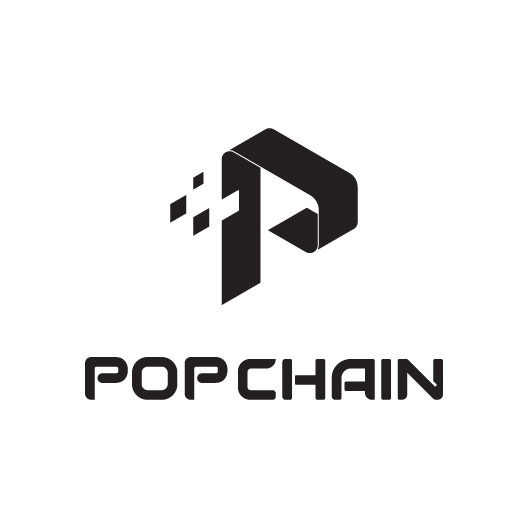

# PopChain

POPCHAIN is a bottom-driven, open, public blockchain for content creators and consumers. Through a blockchain-based ecosystem, POPCHAIN provides a decentralized solution for the entertainment market by ensuring that creators are directly and fairly compensated for their work. 

POPCHAIN can be widely used for live broadcasts, content promotion, code sharing, online games and more, revolutionizing the field of entertainment. By allowing users to access content directly from creators, POPCHAIN cuts out intermediaries that currently dominate the industry as well as the fees that they charge, instead of giving that profit back to the creators.

Basic usage resources:

* [Official site](http://www.popchain.co/)

### Coin Specs
<table>
<tr><td>Algo</td><td>Quark</td></tr>
<tr><td>Block Time</td><td>60 Seconds</td></tr>
<tr><td>Difficulty Retargeting</td><td>Every Block</td></tr>
<tr><td>Max Coin Supply (PoW Phase)</td><td>20,000,000,000 PCH</td></tr>
<tr><td>PoW (w/ Masternode)</td><td>8,000,000,000 PCH</td></tr>
<tr><td>Premine</td><td>12,000,000,000 PCH*</td></tr>
</table>

### Reward Distribution

<table>
<th colspan=4>Genesis Block</th>
<tr><th>Block Height</th><th>Reward Amount</th><th>Notes</th></tr>
<tr><td>1</td><td>12,000,000,000 PCH</td><td>Initial Pre-mine and distributed and swaped amount</td></tr>
</table>

### PoW Rewards Breakdown

<table>
<th>Block Height</th><th>Masternodes</th><th>Miner</th><th>Budget</th>
<tr><td>2-</td><td>5% (6.xx PCH)</td><td>95% (120 PCH)</td><td>N/A</td></tr>
</table>

Contact us:

* contact@popchain.org

Building PopChain
### Build on Ubuntu(16.04 LTS)

    git clone https://github.com/PopchainFoundation/PopChain.git

Install dependency

    sudo apt-get install build-essential libtool autotools-dev automake pkg-config libssl-dev libevent-dev bsdmainutils
    sudo apt-get install libboost-system-dev libboost-filesystem-dev libboost-chrono-dev libboost-program-options-dev libboost-test-dev libboost-thread-dev
    sudo apt-get install software-properties-common
    sudo add-apt-repository ppa:bitcoin/bitcoin
    sudo apt-get update
    sudo apt-get install libdb4.8-dev libdb4.8++-dev
    sudo apt-get install libminiupnpc-dev
    sudo apt-get install libzmq3-dev

    # QT 5, for GUI
    sudo apt-get install libqt5gui5 libqt5core5a libqt5dbus5 qttools5-dev qttools5-dev-tools libprotobuf-dev protobuf-compiler    
    # optional
    sudo apt-get install libqrencode-dev

Configure and build

    ./autogen.sh
    ./configure
    make -j(number of threads)

### Run

    cd src && ./popd -daemon # use ./pop-cli to make rpc call

Development Process
-------------------

The master branch is constantly updated and developed, while stable
and versionized executables will be published once mainnet is published.

Issues and commit changes are welcome.
